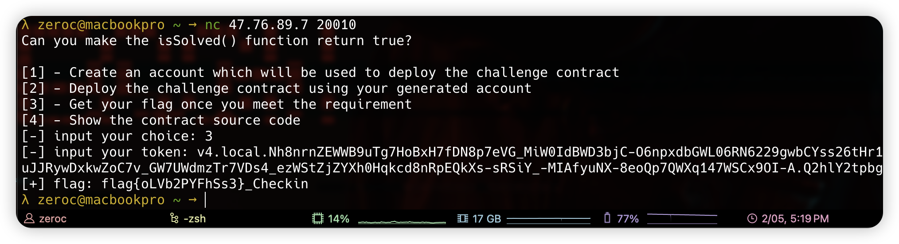

# CheckIn
Just compile the circuit and generate your proof:
```bash
# compile
circom CheckIn.circom --wasm
# generate witness
snarkjs wc CheckIn_js/CheckIn.wasm input.json witness.wtns
# generate proof
snarkjs g16p CheckIn_groth16.zkey witness.wtns proof.json public.json
# export data
snarkjs zkesc public.json proof.json
# deploy the contract
cast send 0x36B9D98146FFdFe1C5E24A25b9d047DaA1b084d7 --value 0.1ether
# verify the proof
cast send 0x35e347cbC0ec885aEb6A503374c7f8c91027fEBa "verify(uint[2],uint[2][2],uint[2],uint[1])(bool)" "[0x1105b7652d65aa27d1d4595eb8357c28b6e12807ea90ae41db8f770432919ef5, 0x0142a3ae8e007d106c1349dcb8756111c4dfcd7a86ff6be0b8f635f6b7089b78]" "[[0x1dbc0936df192af31cd25adb2ec237dc9cb078b947bdf30ef4b6ca68846a46e2, 0x0b09373992665d38345d6a177ddd77f28c213b0b85a0d126a0c75bedcbd3fe32],[0x299e69865951fd3d7cba9c815f259753706e17a0c758bf13830ad869b57cea0a, 0x0b83fdc182be75ea18bcad2a819f323dab36cc8c0f997870ebacd644ffdaf0bb]]" "[0x302a36682a92cf8289077f364e146c37699e5e7b2d32931c7a6a9a257d0c0e7d, 0x21d23921735db03130ed9733cd1db5882e141095b3251b5a3432c2e43e5b5fd8]" "[0x0000000000000000000000000000000000000000000000000000000000000002]"
# check the result
cast call 0x35e347cbC0ec885aEb6A503374c7f8c91027fEBa "isSolved()(bool)"
```

