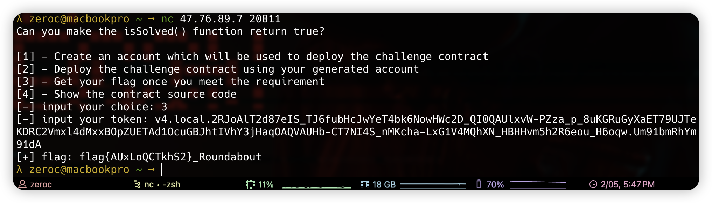

# Roundabout
In this challenge, you need to find the preimage of [MiMC Hash](https://byt3bit.github.io/primesym/mimc/), which only have 2 Rounds.

You can calculate `a, b` with following code:
```python
from sage.all import *
from Crypto.Util.number import *

p = 21888242871839275222246405745257275088548364400416034343698204186575808495617
c = 3066844496547985532785966973086993824
F = GF(p)
a = F(c).nth_root(5) - 1
print(f"a = {a}")
tmp = 37622140664026667386099315436167897444086165906536960040182069717656571868
b = sqrt(tmp * inverse(c**2 % p - 9, p) % p)
print(f"b = {b}")
# a = 19830713
# b = 2
```

Then the normal process:
```bash
# compile
circom Roundabout.circom --wasm
# generate witness
snarkjs wc Roundabout_js/Roundabout.wasm input.json witness.wtns
# generate proof
snarkjs g16p Roundabout_groth16.zkey witness.wtns proof.json public.json
# export data
snarkjs zkesc public.json proof.json
# deploy contract
cast send 0x6368DB7928D8fADf006d3F338Af70194ad6ea97C --value 0.1ether
# verify the proof
cast send 0xa565667C6850DCBF7931e8c3c603D15dE0A46e6B "verify(uint[2],uint[2][2],uint[2],uint[1])(bool)" "[0x03ce588eda8c5b69fe0e5a7bb6bdc46b062f02bb8678f7804aa8758c2cdc0a15, 0x090342389e8ac2cb0f2748f9259c9249e303c26da51f69fe05801247075ed2b0]" "[[0x21069f72ca9dcd022cd57e9d79bc41892074e4b7e9466c3ef77371c491c8a889, 0x0db6cc8e5ac01185dcca5e269584e4d84d587a07c34636c1afbe96e91a5a5693],[0x2d40967e8e4c59192bf31c2827e7589e10a9c78c32a9a54e0d3fecd4baf0e1c2, 0x08333f529fa4b96906434f563455cf442d40b38786217afda66eeb8a2c7bd498]]" "[0x0340162c0eba8509e0e2304e1cb6e3d333884bf631d75143623c9dc9d521d987, 0x0680cdbf805cc6abc95379439c2a5da3129449aab76a5dd7669a47ba03d97418]" "[0x00000000000000000000000000000000000000000000000000000000025d2f72]"
# check the result
cast call 0xa565667C6850DCBF7931e8c3c603D15dE0A46e6B "isSolved()(bool)"
```

